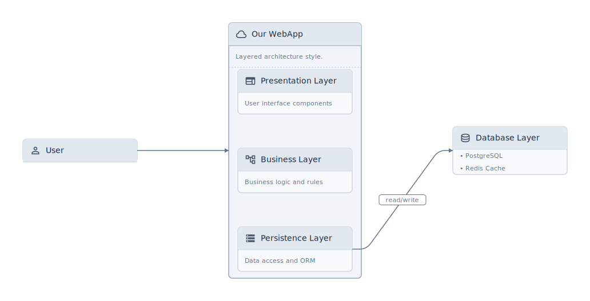
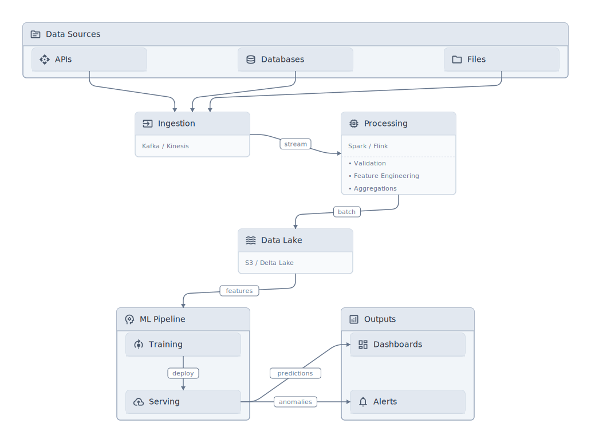
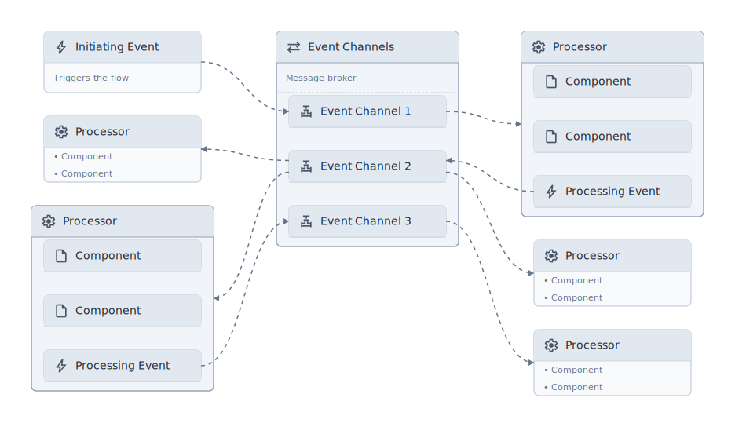

# specplot

> Think in outlines. Ship as diagrams.

[](LICENSE)
[](https://www.python.org/downloads/)



## What is specplot?

A Python library that transforms outline-based thinking into professional architecture diagrams. Write your system design as structured code, render it as publication-ready SVG.

```python
from specplot import diagram, node

with diagram(filename="architecture"):
    user = node(icon="person", label="User")

    with node(
        icon="cloud", label="Our WebApp",
        description="Layered architecture style.",
        show_as="group", grid=(3, 1)
    ) as app:

        node(icon="web", label="Presentation Layer",
             description="User interface components")
        node(icon="account_tree", label="Business Layer",
             description="Business logic and rules")
        persistance = node(icon="storage", label="Persistence Layer",
                           description="Data access and ORM")

    with node(icon="database", label="Database Layer", show_as="outline") as dbs:
        node(label="PostgreSQL")
        node(label="Redis Cache")

    user >> app
    persistence >> dbs | "read/write"
```

**Key Features:**

- **Outline-first** — `show_as="outline"` for bullet lists, `show_as="group"` for nested boxes
- **Pythonic DSL** — Context managers, `>>` for edges, `|` for labels
- **Publication-ready** — Clean SVG output for papers, docs, presentations
- **Smart routing** — A* pathfinding routes edges around obstacles (enabled by default)
- **Material icons** — 2000+ icons from Google Material Symbols

## Quick Start

```bash
pip install git+https://github.com/themerius/specplot.git@main
```

Or with uv:

```bash
uv add git+https://github.com/themerius/specplot.git@main
```

```python
from specplot import diagram, node

with diagram(filename="my_system"):
    user = node(icon="person", label="User")
    api = node(icon="api", label="API")
    db = node(icon="database", label="Database")
    user >> api >> db | "SQL"
```

Run your script — SVG appears in the current directory.

## Examples

### Data Pipeline

Visualize data flows with mixed display modes.



<details>
<summary>View code</summary>

```python
from specplot import diagram, node

with diagram(filename="pipeline", layout=(
    ("LR",), ("LR", "LR"), ("LR",), ("LR", "LR")
)):
    with node(icon="source", label="Data Sources", show_as="group", grid=(1, 3), pos=1):
        api_src = node(icon="api", label="APIs")
        db_src = node(icon="database", label="Databases")
        files = node(icon="folder", label="Files")

    ingest = node(icon="input", label="Ingestion",
                 description="Kafka / Kinesis", pos=2)

    with node(icon="memory", label="Processing",
             description="Spark / Flink",
             show_as="outline", pos=3) as proc:
        node(label="Validation")
        node(label="Feature Engineering")
        node(label="Aggregations")

    lake = node(icon="waves", label="Data Lake",
               description="S3 / Delta Lake", pos=4)

    with node(icon="psychology", label="ML Pipeline", show_as="group", grid=(2, 1), pos=5) as ml:
        train = node(icon="model_training", label="Training")
        serve = node(icon="cloud_upload", label="Serving")

    with node(icon="analytics", label="Outputs", show_as="group", grid=(2, 1), pos=6):
        dash = node(icon="dashboard", label="Dashboards")
        alerts = node(icon="notifications", label="Alerts")

    api_src >> ingest
    db_src >> ingest
    files >> ingest
    ingest >> proc | "stream"
    proc >> lake | "batch"
    lake >> ml | "features"
    train >> serve | "deploy"
    serve >> dash | "predictions"
    serve >> alerts | "anomalies"
```

</details>

### Event-Driven Architecture

Broker topology with event channels and processors.



<details>
<summary>View code</summary>

```python
from specplot import diagram, node, edge

with diagram(filename="event_driven", pathfinding=False,
            layout=(("TB", "TB", "TB"),)):
    # Initiating Event
    initiator = node(icon="bolt", label="Initiating Event",
                    description="Triggers the flow", pos=1)

    # Event Channels (broker)
    with node(icon="sync_alt", label="Event Channels",
             description="Message broker",
             show_as="group", grid=(3, 1), pos=2) as channels:
        ch1 = node(icon="valve", label="Event Channel 1")
        ch2 = node(icon="valve", label="Event Channel 2")
        ch3 = node(icon="valve", label="Event Channel 3")

    # Event Processors (left side)
    with node(icon="settings", label="Processor", show_as="outline", pos=1) as proc2:
        node(label="Component")
        node(label="Component")

    with node(icon="settings", label="Processor", show_as="group", grid=(3, 1), pos=1) as proc4:
        node(label="Component")
        node(label="Component")
        proc_event2 = node(icon="bolt", label="Processing Event")

    # Event Processors (right side)
    with node(icon="settings", label="Processor", show_as="group", grid=(3, 1), pos=3) as proc1:
        node(label="Component")
        node(label="Component")
        proc1_event = node(icon="bolt", label="Processing Event")

    with node(icon="settings", label="Processor", show_as="outline", pos=3) as proc3:
        node(label="Component")
        node(label="Component")

    with node(icon="settings", label="Processor", show_as="outline", pos=3) as proc5:
        node(label="Component")
        node(label="Component")

    # Connections (dotted arrows for async events)
    edge(initiator, ch1, style='..>')
    edge(ch1, proc1, style='..>')
    edge(proc1_event, ch2, style='..>')
    edge(ch2, proc2, style='..>')
    edge(ch2, proc3, style='..>')
    edge(ch2, proc4, style='..>')
    edge(proc_event2, ch3, style='..>')
    edge(ch3, proc5, style='..>')
```

</details>

## Why specplot?

- **Outline-first design** — Structure architecture the way you think: hierarchical, iterative, refactorable
- **Code is the diagram** — Version control, automation, and seamless AI collaboration
- **LLM-native** — Both Python input and SVG output are text formats AI can read, write, and reason about
- **Publication-ready** — Clean vector graphics for papers, docs, and high-stakes presentations

[Read the full philosophy →](docs/PHILOSOPHY.md)

[Compare with alternatives →](docs/COMPARISON.md)

## Documentation

See [docs/README.md](docs/README.md) for the full reference documentation.

## Support

If specplot helps your work, consider:

- Starring this repository
- Citing it in your publications

### Citation

```bibtex
@software{specplot,
  author = {Hodapp, Sven},
  title = {specplot: Outline-based architecture diagrams},
  year = {2026},
  url = {https://github.com/themerius/specplot}
}
```

## License

[MIT](LICENSE)
